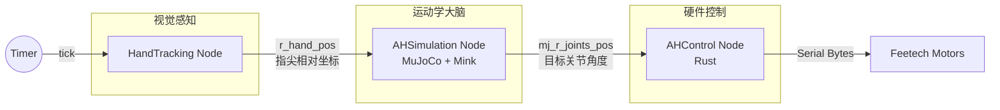

# AmazingHand 项目入门 INTRO

## 项目架构概览

AmazingHand 采用分层架构，核心利用 **Dora-rs** 框架进行数据流编排。

### 1. 目录结构与层级映射

```text
d:\AAA-personalData\project\AmazingHand\Dev
├── AHControl/                     [物理与通信层] & [驱动封装层]
│   ├── src/main.rs                -> Rust 编写的硬件控制节点，接收指令并驱动舵机
│   └── config/*.toml              -> 硬件配置文件，定义关节与舵机ID的映射
├── AHSimulation/                  [应用逻辑层 - 运动学大脑]
│   ├── Src/mj_mink_right.py       -> 基于 MuJoCo 和 Mink 的逆运动学 (IK) 求解器
│   └── Src/AH_Right/mjcf/         -> 机械手的 3D 物理模型 (URDF/XML)
├── HandTracking/                  [应用逻辑层 - 视觉感知]
│   └── Src/main.py                -> 使用 MediaPipe 捕捉手部关键点，输出指尖向量
├── FixedAction/                   [应用逻辑层 - 脚本化动作]
│   └── Python/*.py                -> 不依赖 Dora 的独立脚本，用于测试或展示预设动作
├── dataflow_*.yml                 [业务编排层]
│   └── dataflow_tracking_real.yml -> 定义 "感知 -> 计算 -> 执行" 的数据流水线
└── Cargo.toml                     -> Rust 项目依赖管理
```

### 2. 核心四层架构

*   **物理与通信层**：直接与硬件对话，发送串口指令。
*   **驱动封装层**：将串口协议封装为高级语言对象，并将控制逻辑封装为 Dora 节点。
*   **应用逻辑层**：
    *   **感知** (`HandTracking`)：负责“看”，把图像变成坐标。
    *   **大脑** (`AHSimulation`)：负责“想”，把坐标变成关节角度。
*   **业务编排层**：指挥各个模块协同工作。

## Task 1: 物理与通信层

这一层负责将**数字信号 (Digital Signal)** 转化为**物理动作 (Physical Action)**。

### 1. 硬件配置文件 (`AHControl/config/r_hand.toml`)

机械手由多个舵机组成，每个舵机都有一个唯一的 ID。配置文件定义了“手指”与“舵机”的对应关系。

[r_hand.toml](AHControl/config/r_hand.toml)
```toml
[[motors]]
finger_name="r_finger1" # 食指
motor1.id = 1           # 第1关节舵机ID
motor1.offset = 0.122   # 机械零点偏移量 (弧度)
motor1.invert = false   # 是否反向
motor2.id = 2           # 第2关节舵机ID
...
```
*   **类比**：这就像给钢琴键贴标签。`motor1.id = 1` 告诉程序，“当你按‘食指根部’这个键时，去敲击编号为 1 的琴弦”。
*   **Offset**: 消除安装误差。舵机的 0 度可能不是手指伸直的状态，通过 Offset 进行软件校准。

### 2. 硬件控制节点 (`AHControl/src/main.rs`)

这是直接控制硬件的 Rust 程序。它做了三件事：
1.  **读取配置**：解析 `.toml` 文件。
2.  **建立连接**：打开串口 (如 `COM3`)。
3.  **发送指令**：接收上层发来的关节角度，计算最终舵机目标位置，并通过串口发送。

[main.rs](AHControl/src/main.rs)
```rust
// 核心循环
while let Some(event) = events.recv() {
    match event {
        Event::Input { id, metadata, data } => match id.as_str() {
            "mj_r_joints_pos" => {
                // 1. 获取仿真层传来的关节角度 (buffer)
                // 2. 加上 offset (m1goal = buffer[...] + finger.motor1.offset)
                // 3. 处理反向 (if invert { m1goal = -m1goal })
                // 4. 发送给舵机 (controller.sync_write_goal_position...)
            }
            // ...
        }
    }
}
```

## Task 2: 驱动封装层

### 1. Rustypot (通信协议封装)

项目中引用了 `rustypot` 库。它封装了 Feetech 舵机的通信协议。
*   **作用**：你不需要手写 `0xFF 0xFF 0x01...` 这样的十六进制指令。你只需要调用 `controller.write_goal_position(id, angle)`，它会自动打包成字节流并通过串口发送。

### 2. Dora Node (逻辑封装)

`AHControl` 本身被封装为一个 **Dora Node**。
- **输入**：`mj_r_joints_pos` (来自仿真层的纯净关节角度)。
- **输出**：无 (直接驱动硬件)。
- **意义**：这种封装隔离了硬件细节。上层的算法只需要关心“我要把手弯成什么角度”，而不需要关心“是哪种舵机、波特率是多少”。

## Task 3: 应用逻辑层 - 运动学解算

这是整个系统中最聪明的部分。它解决了一个核心难题：**我知道指尖要在哪里，但我不知道每个关节该转多少度。** 这就是 **逆运动学 (Inverse Kinematics, IK)**。

### 1. 仿真环境 (`AHSimulation/Src/mj_mink_right.py`)

该模块使用 **MuJoCo** 物理引擎和 **Mink** 库。

[mj_mink_right.py](AHSimulation/Src/mj_mink_right.py)

#### 工作流程：
1.  **接收目标 (`hand_pos`)**：从视觉层接收指尖的空间坐标。
2.  **更新“幻影” (`mocap`)**：在仿真世界中，移动几个看不见的“目标点” (Mocap Bodies) 到指尖坐标的位置。
    ```python
    # 将视觉坐标映射到仿真空间
    self.data.mocap_pos[0]=[x.as_py()*1.5-0.025, ... ]
    ```
3.  **求解 IK (`mink.solve_ik`)**：计算“如果要让虚拟手的指尖碰到这些目标点，关节需要怎么转？”。
    *   这里使用了 `FrameTask`，告诉求解器：**Tip (指尖)** 必须尽可能靠近 **Target (目标点)**。
4.  **发送结果 (`mj_r_joints_pos`)**：将算出来的虚拟关节角度发送给硬件控制层。

*   **类比**：这就像木偶戏。`HandTracking` 告诉你木偶的手应该在哪，`AHSimulation` 计算牵引绳（关节）应该拉多长，最后 `AHControl` 负责实际拉绳子。

## Task 4: 应用逻辑层 - 视觉感知

负责从摄像头画面中提取手部信息。

### 1. 视觉捕捉 (`HandTracking/Src/main.py`)

使用 Google 的 **MediaPipe** 库。

[main.py](HandTracking/Src/main.py)

#### 核心算法：
1.  **检测关键点**：识别手部的 21 个关键点 (Landmarks)。
2.  **构建局部坐标系**：
    *   为了让动作不受手掌旋转的影响，代码构建了一个**以手掌为中心**的局部坐标系。
    *   **原点**：手腕 (Wrist)。
    *   **Z轴**：手腕指向中指根部。
    *   **X/Y轴**：通过向量叉乘计算得出。
3.  **计算指尖向量**：计算指尖相对于该局部坐标系的位置 (`tip = R @ (tip_global - origin)`)。
4.  **输出数据**：`r_hand_pos` 包含的是**相对坐标**。这意味着哪怕你歪着头、或者旋转手掌，只要手指弯曲程度不变，输出的数据就不变。这对机械手的稳定性至关重要。

## Task 5: 业务编排层

`dataflow_tracking_real.yml` 是系统的总指挥，它定义了数据如何流动。

[dataflow_tracking_real.yml](dataflow_tracking_real.yml)

### 系统数据流图 (Mermaid)



### 关键配置解读
*   **`tick: dora/timer/millis/10`**: 系统心跳。每 10ms 触发一次循环，保证了系统的高实时性 (100Hz)。
*   **`inputs` / `outputs`**: 显式定义了节点间的依赖关系。例如 `AHSimulation` 必须等待 `hand_tracker/r_hand_pos` 到达后才会计算。

## 总结：从像素到动作的全过程

1.  **摄像头** 拍到你的手。
2.  **HandTracking** 算出你的指尖相对于手腕弯曲了多少，发给仿真器。
3.  **AHSimulation** 在虚拟世界里摆弄虚拟手，算出要达到这个弯曲度，每个关节需要转多少度。
4.  **AHControl** 收到角度，加上校准偏移，通过串口告诉舵机。
5.  **舵机** 旋转，机械手模仿了你的动作。